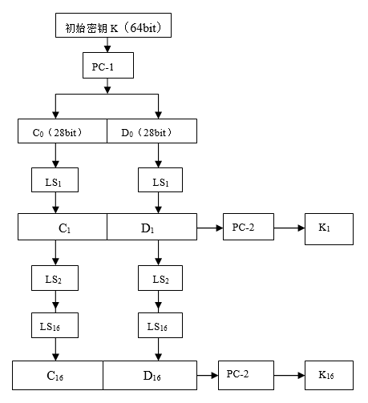

# DES分组加密算法

--------------------------------------
* TOC
{:toc}

## 1. DES简介

　　**DES密码** 实际上是Lucifer密码的进一步发展。它是一种采用传统加密方法的区组密码。它的算法是对称的，既可用于加密又可用于解密。

　　**美国数据加密标准—DES(Data Encryption Standard):**
美国NBS在1973年5月15公布了征求建议。1974年8月27日NBS再次出公告征求建议，对建议方案提出如下要求：

>1. 算法必须完全确定而无含糊之处；
>2. 算法必须有足够高的保护水准，即可以检测到威胁，恢复密钥所必须的运算时间或运算次数足够大；
>3. 保护方法必须只依赖于密钥的保密；
>4. 对任何用户或产品供应者必须是不加区分的。

　　DES算法的入口参数有三个：**Key**、**Data**、**Mode**。其中Key为8个字节共64位，是DES算法的工作密钥；Data也为8个字节64位，是要被加密或被解密的数据；Mode为DES的工作方式，有两种：加密或解密。

`DES算法是这样工作的:`

> 如Mode为加密，则用Key 去把数据Data进行加密， 生成Data的密码形式（64位）作为DES的输出结果；如Mode为解密，则用Key去把密码形式的数据Data解密，还原为Data的明码形式（64位）作为DES的输出结果。在通信网络的两端，双方约定一致的Key，在通信的源点用Key对核心数据进行DES加密，然后以密码形式在公共通信网（如电话网）中传输到通信网络的终点，数据到达目的地后，用同样的Key对密码数据进行解密，便再现了明码形式的核心数据。这样，便保证了核心数据（如PIN、MAC等）在公共通信网中传输的安全性和可靠性。

通过定期在通信网络的源端和目的端同时改用新的Key，便能更进一步提高数据的保密性，这正是现在金融交易网络的流行做法。

## 2. DES算法详述
**1.  DES加密标准**

　　现如今，依靠Internet的分布式计算能力，用穷举密钥搜索攻击方法破译已成为可能。数据加密标准DES已经达到它的信任终点。但是作为一种Feistel加密算法的例子仍然有讨论的价值。
DES是对二元数字分组加密的分组密码算法，分组长度为64比特。每64位明文加密成64位密文，没有数据压缩和扩展，密钥长度为56比特，若输入64比特，则第`8，16，24，32，40，48，56，64`为奇偶校验位，所以，实际密钥只有56位。DES算法完全公开，其保密性完全依赖密钥。
它的缺点就在于`密钥太短`。

　　设明文串: $$m=m_1m_2\cdots m_{64}$$；
　　密钥串： $k=k_1k_2\cdots k_{64}$。

在后面的介绍中可以看到 $k_8,k_{16},k_{24},k_{32},k_{40},k_{48},k_{56},k_{64}$实际上是不起作用的。
DES的加密过程可表示为：

> $DES(m)= IP^{-1}T_{16}T_{15} \cdots T_2·T_1·IP(m)$
> - 初始置换， $IP$
> - 16轮迭代，$T_i ,   i=1,2 \cdots 16$
> - 末置换，$IP^{-1}$

下面是完全16轮DES算法框图：


{: class="myimg" }

**1. 初始置换$IP$**

　　初始置换是将输入的64位明文分为8个数组，每一组包括8位，按1至64编号。
$IP$的置换规则如下表：


即将输入的第58位换到第1位，第50位换到第2位......依次类推，最后一位是原来的第7位。

**2. $IP^{-1}$是$IP$的逆置换**

　　由于第1位经过初始置换后，已处于第40位。逆置换就是再将第40位换回到第1位。
逆置换规则如下表所示：


初始置换$IP$及其逆置换$IP^{-1}$并没有密码学意义，因为置换前后的一一对应关系是已知的。**它们的作用在于打乱原来输入明文的ASCⅡ码字划分的关系，并将原来明文的第$m_8，m_{16}，m_{24}，m_{32}，m_{40}，m_{48}，m_{56}，m_{64}$位（校验位）变成$IP$的输出的一个字节。**

## 3. DES算法的迭代过程


　　图中$L_{i-1}$和$R_{i-1}$分别是第$i-1$次迭代结果的左右两部分，各$32$比特。即$L_i=R_{i-1}, R_i=L_{i-1} \otimes f(R_{i-1},k_i)$。其中密钥$K_i$为$48$比特，函数$F(R,K)$的计算过程如**图3**所示。输入的右半部分$R$为$32$比特，$R$首先被扩展成$48$比特，扩展过程由 **表3** 定义，其中将$R$的$16$个比特各重复一次。扩展后的$48$比特再与子密钥$K_i$异或，然后再通过一个$S$盒，产生$32$比特的输出。该输出再经过一个由 **表4** 定义的压缩置换，产生的结果即为函数$F(R,K)$的输出。


$k_i$是由$64$比特的初始密钥（亦称种子密钥）导出的第$i$轮子密钥，$k_i$是$48$比特。
DES算法的关键是$f(R_{i-1},k_i)$的功能，其中的重点又在$S-盒（Substitution Boxes）$上。$F$函数的输出是$32$比特。


将$R$经过一个扩展运算$E$变为$48$位，记为$E（R）$。计算 $E（R）\otimes K=B$，对 $B$ 施行代换 $S$，此代换由$8$个代换盒组成，即$S-盒$。每个$S-盒$有$6$个输入，$4$个输出，将$B$依次分为$8$组，每组$6$位，记 $B= B_1B_2B_3B_4B_5B_6B_7B_8$其中$B_j$作为第$j个S-盒$的输入，其输出为$C_j，C= C_1C_2C_3C_4C_5C_6C_7C_8$就是代换$S$的输出，所以代换$S$是一个$48$位输入，$32$位输出的选择压缩运算，将结果$C$再实行一个置换$P$**（表4）**，即得$F(R,K)$。
其中，扩展运算$E$与置换$P$主要作用是: `增加算法的扩散效果。`$S-盒$是DES算法中**唯一的非线性部件**，当然也就是整个算法的安全性所在。它的设计原则与过程一直因为种种不为人知的因素所限，而未被公布出来。

**S-盒如下表：**


**S-盒的置换规则为：**

> 取 ${0，1，\cdots，15}$上的 4个置换，即它的4个排列排成4行，得一$4*16$矩阵。若给定该$S盒$的6个输入为 $b_0 b_1 b_2 b_3 b_4 b_5$,在$S_i$表中找出$b_0 b_5行$，$b_1b_2b_3b_4列$的元素，以4位二进制表示该元素，此为 $S-盒S_i$的输出。
 
 **例1: **   $S_2$的输入为$101011$，
 $ 行：b_0 =1，b_5=1，b_0 b_5=2_{(11)}=3 $
 $ 列：(b_1 b_2 b_3 b_4)=5_{(0101)}=5   $
 查$S_2$表可知 $第4行第6列$ 的输出是 $15，15$ 的二进制表示为 $1111$。则$S_2$的输出为$1111$。
 
 8个S-盒的代换方式都是一样的。

**P置换**

　　$P置换$的功能是将32位的输入，按以下顺序置换，然后输入仍为32比特。P置换的顺序如**表5：**

 **表5： P置换**

| 16  | 7   | 20  | 21  |
|:---:|:---:|:---:|:---:|
| 29  | 12  | 28  | 17  |
| 1   | 15  | 23  | 26  |
| 5   | 18  | 31  | 10  |
| 2   | 8   | 24  | 14  |
| 32  | 27  | 3   | 9   |
| 19  | 13  | 30  | 6   |
| 22  | 11  | 4   | 25  |
{: class="mytable" }

## 4. 子密钥的生成

**图4:** DES子密钥生成流程图



图4给出了子密钥产生的流程图。首先对初始密钥经过置换$PC-1（表6）$，`将初始密钥的8个奇偶校验位剔除掉，而留下真正的56比特初始密钥。`

 **表6： PC-1置换**

|57	  |49	|41	  |33	|25	  |17	|9    |
|:---:|:---:|:---:|:---:|:---:|:---:|:---:|
| 1	  |58	|50	  |42	|34	  |26	|18   |
|10	  |2	|59	  |51	|43	  |35	|27   |
|19	  |11	|3	  |60	|52	  |44	|36   |
|63	  |55	|47	  |39	|31	  |23	|15   |
|7	  |62	|54	  |46	|38	  |30	|22   |
|14	  |6	|61	  |53	|45	  |37	|29   |
|21	  |13	|5	  |28	|20	  |12	|4    |
{: class="mytable" }

然后将此56位分为$C_0，D_0$两部分，各28比特，$C_0，D_0$如下：
$C_0=k_{57}k_{49}\cdots k_{44}k_{36}$
$D_0=k_{63}k_{55}\cdots k_{12}k_{4}$
然后分别进行一个循环左移函数$LS1$，得到$C_1，D_1，$将$C_1（28位）,D_1（28位）$连成56比特数据，再经过密钥置换$PC-2（表7）$做重排动作，从而便得到了密钥 $K_1（48位）$。依次类推，便可得到 $K_2，K_3 \cdots K_{16}。$

 **表7： PC-2置换**

|14	  |17	|11	  |24	|1	  |5    |
|:---:|:---:|:---:|:---:|:---:|:---:|
|3	  |28	|15	  |6	|21	  |10   |
|23	  |19	|12	  |4	|26	  |8    |
|16	  |7	|27	  |20	|13	  |2    |
|41	  |52	|31	  |37	|47	  |55   |
|30	  |40	|51	  |45	|33	  |48   |
|44	  |49	|39	  |56	|34	  |53   |
|46	  |42	|50	  |36	|29	  |32   |
{: class="mytable" }

其中$LS_i（1≤i≤16）$表示一个或两个位置的循环左移，当$i=1，2，9，16$时，移一个位置，当$i=3，4，5，6，7，8，10，11，12，13，14，15$ 时，移两个位置。

## 5. DES算法的解密过程
　　DES算法的解密过程跟加密过程是一样的，区别仅仅在于第一次迭代时用密钥$k_{16}$，第二次$k_{15}、\cdots $，最后一次用$k_1$，算法本身没有任何变化。

## 6. DES算法的C++实现

``` c

#include <memory>
#include <iostream>
#include <string>
using namespace std;

enum  { encrypt, decrypt };//ENCRYPT:加密，DECRYPT：解密
void des_run(char out[8], char in[8], bool type = encrypt);
//设置密钥
void des_setkey(const char key[8]);
static void f_func(bool in[32], const bool ki[48]);//f函数
static void s_func(bool out[32], const bool in[48]);//s盒压缩变换
//变换
static void transform(bool *out, bool *in, const char *table, int len);
static void xor(bool *ina, const bool *inb, int len);//异或
static void rotatel(bool *in, int len, int loop);//循环左移
//字节组转换成位组
static void bytetobit(bool *out, const char *in, int bits);
//位组转换成字节组
static void bittobyte(char *out, const bool *in, int bits);
//置换IP表
const static char ip_table[64] = { 
	58, 50, 42, 34, 26, 18, 10, 2, 
	60, 52, 44, 36, 28, 20, 12, 4, 
	62, 54, 46, 38, 30, 22, 14, 6, 
	64, 56, 48, 40, 32, 24, 16, 8, 
	57, 49, 41, 33, 25, 17, 9,  1, 
	59, 51, 43, 35, 27, 19, 11, 3, 
	61, 53, 45, 37, 29, 21, 13, 5, 
	63, 55, 47, 39, 31, 23, 15, 7 
};
//逆置换IP-1表
const static char ipr_table[64] = { 
	40, 8, 48, 16, 56, 24, 64, 32, 
	39, 7, 47, 15, 55, 23, 63, 31, 
	38, 6, 46, 14, 54, 22, 62, 30, 
	37, 5, 45, 13, 53, 21, 61, 29, 
	36, 4, 44, 12, 52, 20, 60, 28, 
	35, 3, 43, 11, 51, 19, 59, 27, 
	34, 2, 42, 10, 50, 18, 58, 26, 
	33, 1, 41, 9,  49, 17, 57, 25 
};
//E 位选择表
static const char e_table[48] = { 
	32, 1,  2,  3,  4,  5,
	4,  5,  6,  7,  8,  9, 
	8,  9,  10, 11, 12, 13, 
	12, 13, 14, 15, 16, 17, 
	16, 17, 18, 19, 20, 21, 
	20, 21, 22, 23, 24, 25, 
	24, 25, 26, 27, 28, 29, 
	28, 29, 30, 31, 32, 1 
};
//P换位表
const static char p_table[32] = { 
	16, 7,  20, 21, 
	29, 12, 28, 17, 
	1,  15, 23, 26, 
	5,  18, 31, 10, 
	2,  8,  24, 14, 
	32, 27, 3,  9, 
	19, 13, 30, 6, 
	22, 11, 4,  25 
};
//pc1选位表
const static char pc1_table[56] = {
	57, 49, 41, 33, 25, 17, 9,  1,
	58, 50, 42, 34, 26, 18, 10, 2,
	59, 51, 43, 35, 27, 19, 11, 3,
	60, 52, 44, 36, 63, 55, 47, 39,
	31, 23, 15, 7,  62, 54, 46, 38,
	30, 22, 14, 6,  61, 53, 45, 37,
	29, 21, 13, 5,  28, 20, 12, 4
};
//pc2选位表
const static char pc2_table[48] = {
	14, 17, 11, 24, 1, 5, 3, 28,
	15, 6, 21, 10, 23, 19, 12, 4,
	26, 8, 16, 7, 27, 20, 13, 2,
	41, 52, 31, 37, 47, 55, 30, 40,
	51, 45, 33, 48, 44, 49, 39, 56,
	34, 53, 46, 42, 50, 36, 29, 32
};
//左移位数表
const static char loop_table[16] = { 1, 1, 2, 2, 2, 2, 2, 2, 1, 2, 2, 2, 2, 2, 2, 1 };
//S盒
const static char s_box[8][4][16] = {
	//s1
	14, 4,  13, 1, 2,  15, 11, 8,  3,  10, 6,  12, 5,  9,  0, 7,
	0,  15, 7,  4, 14, 2,  13, 1,  10, 6,  12, 11, 9,  5,  3, 8,
	4,  1,  14, 8, 13, 6,  2,  11, 15, 12, 9,  7,  3,  10, 5, 0,
	15, 12, 8,  2, 4,  9,  1,  7,  5,  11, 3,  14, 10, 0,  6, 13,
	//s2
	15, 1,  8,  14, 6,  11, 3,  4,  9,  7, 2,  13, 12, 0, 5,  10,
	3,  13, 4,  7,  15, 2,  8,  14, 12, 0, 1,  10, 6,  9, 11, 5,
	0,  14, 7,  11, 10, 4,  13, 1,  5,  8, 12, 6,  9,  3, 2,  15,
	13, 8,  10, 1,  3,  15, 4,  2,  11, 6, 7,  12, 0,  5, 14, 9,
	//s3
	10, 0,  9,  14, 6, 3,  15, 5,  1,  13, 12, 7,  11, 4,  2,  8,
	13, 7,  0,  9,  3, 4,  6,  10, 2,  8,  5,  14, 12, 11, 15, 1,
	13, 6,  4,  9,  8, 15, 3,  0,  11, 1,  2,  12, 5,  10, 14, 7,
	1,  10, 13, 0,  6, 9,  8,  7,  4,  15, 14, 3,  11, 5,  2,  12,
	//s4
	7,  13, 14, 3, 0,  6,  9,  10, 1,  2, 8, 5,  11, 12, 4,  15,
	13, 8,  11, 5, 6,  15, 0,  3,  4,  7, 2, 12, 1,  10, 14, 9,
	10, 6,  9,  0, 12, 11, 7,  13, 15, 1, 3, 14, 5,  2,  8,  4,
	3,  15, 0,  6, 10, 1,  13, 8,  9,  4, 5, 11, 12, 7,  2,  14,
	//s5
	2,  12, 4,  1,  7,  10, 11, 6,  8,  5,  3,  15, 13, 0, 14, 9,
	14, 11, 2,  12, 4,  7,  13, 1,  5,  0,  15, 10, 3,  9, 8,  6,
	4,  2,  1,  11, 10, 13, 7,  8,  15, 9,  12, 5,  6,  3, 0,  14,
	11, 8,  12, 7,  1,  14, 2,  13, 6,  15, 0,  9,  10, 4, 5,  3,
	//s6
	12, 1,  10, 15, 9, 2,  6,  8,  0,  13, 3,  4,  14, 7,  5,  11,
	10, 15, 4,  2,  7, 12, 9,  5,  6,  1,  13, 14, 0,  11, 3,  8,
	9,  14, 15, 5,  2, 8,  12, 3,  7,  0,  4,  10, 1,  13, 11, 6,
	4,  3,  2,  12, 9, 5,  15, 10, 11, 14, 1,  7,  6,  0,  8,  13,
	//s7
	4,  11, 2,  14, 15, 0, 8,  13, 3,  12, 9, 7,  5,  10, 6, 1,
	13, 0,  11, 7,  4,  9, 1,  10, 14, 3,  5, 12, 2,  15, 8, 6,
	1,  4,  11, 13, 12, 3, 7,  14, 10, 15, 6, 8,  0,  5,  9, 2,
	6,  11, 13, 8,  1,  4, 10, 7,  9,  5,  0, 15, 14, 2,  3, 12,
	//s8
	13, 2,  8,  4, 6,  15, 11, 1,  10, 9,  3,  14, 5,  0,  12, 7,
	1,  15, 13, 8, 10, 3,  7,  4,  12, 5,  6,  11, 0,  14, 9,  2,
	7,  11, 4,  1, 9,  12, 14, 2,  0,  6,  10, 13, 15, 3,  5,  8,
	2,  1,  14, 7, 4,  10, 8,  13, 15, 12, 9,  0,  3,  5,  6,  11
};
static bool subkey[16][48];//16圈子密钥
void des_run(char out[8], char in[8], bool type)
{
	static bool m[64], tmp[32], *li = &m[0], *ri = &m[32];
	bytetobit(m, in, 64);
	//IP置换
	transform(m, m, ip_table, 64);
	if (type == encrypt){
		for (int i = 0; i<16; i++){
			memcpy(tmp, ri, 32);
			f_func(ri, subkey[i]);
			xor(ri, li, 32);
			memcpy(li, tmp, 32);
		}
	}
	else{
		for (int i = 15; i >= 0; i--){
			memcpy(tmp, li, 32);
			f_func(li, subkey[i]);
			xor(li, ri, 32);
			memcpy(ri, tmp, 32);
		}
	}
	//IP逆置换
	transform(m, m, ipr_table, 64);
	bittobyte(out, m, 64);
}
/*****************************************************************
*此函数的功能是由64比特的密钥产生16个子密钥ki保存到subkey[16][48]。
*输入：8Byte初始密钥
******************************************************************/
void des_setkey(const char key[8])
{
	static bool k[64], *kl = &k[0], *kr = &k[28];
	bytetobit(k, key, 64);
	//PC-1置换（剔除奇偶校验位）
	transform(k, k, pc1_table, 56);
	for (int i = 0; i<16; i++)
	{
		rotatel(kl, 28, loop_table[i]);
		rotatel(kr, 28, loop_table[i]);
		//PC-2重排（产生16轮子密钥）
		transform(subkey[i], k, pc2_table, 48);
	}
}
void f_func(bool in[32], const bool ki[48])
{
	static bool mr[48];
	//E盒置换
	transform(mr, in, e_table, 48);
	xor(mr, ki, 48);
	//S盒置换
	s_func(in, mr);
	//P置换
	transform(in, in, p_table, 32);
}
/*******************************
*S盒置换将48位中间数据压缩为32位
*********************************/
void s_func(bool out[32], const bool in[48])
{
	for (char i = 0, j, k; i<8; i++, in += 6, out += 4)
	{
		j = (in[0] << 1) + in[5];
		k = (in[1] << 3) + (in[2] << 2) + (in[3] << 1) + in[4];
		bytetobit(out, &s_box[i][j][k], 4);
	}
}
void transform(bool *out, bool *in, const char *table, int len)
{
	static bool tmp[256];
	for (int i = 0; i<len; i++)
		tmp[i] = in[table[i] - 1];
	memcpy(out, tmp, len);
}
void xor(bool *ina, const bool *inb, int len)
{
	for (int i = 0; i<len; i++)
		ina[i] ^= inb[i];
}
/***************************************
* 循环左移函数
* @in:  待处理数据
* @len: 数据长度
* @loop 循环移位步长
***************************************/
void rotatel(bool *in, int len, int loop)
{
	static bool tmp[256];
	memcpy(tmp, in, loop);
	memcpy(in, in + loop, len - loop);
	memcpy(in + len - loop, tmp, loop);
}
/*****************************************
*字节码转换为比特码
*@in : 输入的字节码8位
*@out: 输出的bit码64位（低位先入小段存储）
*@bits bit码的位数
**************************************************/
void bytetobit(bool *out, const char *in, int bits)
{
	for (int i = 0; i<bits; i++)
		out[i] = (in[i / 8] >> (i % 8)) & 1;
}
/***************************************
*比特码转换为字节码
*@in:  输入的bit码64位（小端存储）
*@out: 输出的字节码8位
*@bits:bit码的位数
****************************************/
void bittobyte(char *out, const bool *in, int bits)
{
	//memset(out, 0, (bits + 7) / 8);
	memset(out, 0, bits / 8);
	for (int i = 0; i<bits; i++)
		out[i / 8] |= in[i] << (i % 8);
}
void main()
{
	char key[9] = { 'd', 'e', 's', 'k', 'e', 'y' }, str[9];
	string str_input, str_output;
	int length;
	cout << "*****************DESSimulater***********************" << endl;
	des_setkey(key);
	cout<<"please input the words you want to encrypt:"<<endl;
	getline(cin,str_input);
	length = str_input.size();
	start = clock();
	for (int i = 0; i * 8 <= length; i++){
		if ((length - i * 8) >= 8){
			strncpy_s(str, str_input.substr(i * 8, (i + 1) * 8).c_str(), 8);
		}
		else{
			strcpy_s(str, str_input.substr(i * 8, str_input.size()).c_str());
			for (int j = length - i*8; j < 8; j++){
				str[j] = ' ';
			}
			//防止出现加密后为‘\0’的字符，使拷贝函数拷贝完造成数组访问越界的错误处理。
			str[8] = '\0';
		}
		des_run(str, str, encrypt);
		for (int j = 0; j < 8; j++){
			str_output.push_back(str[j]);
		}
	}
	cout<<"****************************************"<<endl;
	cout<<"after encrypting the ciphertext is:"<<endl;
	cout << str_output << endl;
	cout<<"****************************************"<<endl;
	cout<<"after decrypting the plain text is:"<<endl;
	for (int i = 0; i * 8 <= length; i++){
		strncpy_s(str, str_output.substr(i * 8, (i + 1) * 8).c_str(), 8);
		//防止出现加密后为‘\0’的字符，使拷贝函数拷贝完造成数组访问越界的错误处理。
		str[8] = '\0';
		des_run(str, str, decrypt);
		cout << str;
	}
	cout<<"****************************************"<< endl;

}

```
