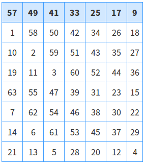

* TOC
{:toc}

## 1. 添加TOC   

#### kramdown 配置

　　配置如下:   

``` yml
markdown: kramdown
  toc_levels: 2..3
```
　　其中, toc_levels 是用来指定那些标题会进入目录。   
　　因为写作习惯, 我这里就只配置为 h2, h3 进入目录。

#### 在文章中使用

　　完成配置后, 在文章中需要的地方添加以下两行   

```   
* toc
{:toc}
```
　　kramdown 引擎会帮我们把上面两行按配置解析成 toc, 也就是目录了.   
  如果没有第一行的列表标识的话, kramdown 是不会进行正确的 toc 解析的。  

#### 让TOC飘起来

　　为了让 TOC 更在阅读的时候更方便, 我们需要修改一下样式。   
　　kramdown 解析出来的 TOC 的 id 为 markdown-toc. 所以我们修改样式如下：

``` css
#markdown-toc:before {
    content: "目录:";
    font-weight: bold;
}
ul#markdown-toc {
    list-style: none;
    position: fixed;
    padding: 0px;
    left: 10px;
    bottom: 200px;
    border-radius: 0.3em;
    box-shadow: rgba(0,0,0,0.15) 0 1px 4px;
    box-sizing: border-box;
    border: #00ee00 1px solid;
    background-color: white;
    z-index:2;
}
```
　　这样一个在文章左边悬停的 TOC 就做了好。   

#### 注意
　　-TOC 的锚, 在跳转时因为 navbar-fixed-top 的问题, 调整 h1~h6 的``` 样式为：{margin-top:-70px;padding-top:70px}````。   
　　-小标题能太长.. 要不会盖到文章正文。

## 2. 自定义表格
　　kramdown引擎解析出来的表格不带表格边界，在画数学表格时非常不方便，且渲染出来的表格非常难看，故本人自定义了markdown表格的表现方式。

#### 表格配置
``` css
.mytable{
    border:1px solid #007eff;
    border-collapse:collapse;
	margin: 20px auto 20px auto;
	
}

.mytable caption{
	font-weight:bold;
	text-align:center;
}

.mytable th{
    border:1px solid #429fff;
    background-color:#d2e8ff;
    font-weight:bold;
    padding-top:4px;
    padding-bottom:4px;
    padding-left:10px;
    padding-right:10px;
    text-align:center;
}

.mytable td{
      border:1px solid #429fff;
      text-align:left;
      padding:4px;
}

.mytable tr:hover{
    background-color:#c4e4fe;
}
```

#### 使用
　　**[Inline Attribute Lists](http://kramdown.gettalong.org/syntax.html#usage-of-tabs)** 用于给document元素添加属性   
　　kramdown引擎的这一语法特性来源于maruku，其语法和标准markdown语法不同。   
　　使用方法举例：   

```
A simple paragraph with an ID attribute.   
{: #para-one}   
A blockquote with a title   
{:title="The blockquote title"}   
{: #myid}   
{:.ruby}   
    Some code here
```
　　因此在本博客中通过在表格下``` 添加:{: class="mytable" }```即可使用css中的配置   
　　最后还需要在头文件中引入`<link rel="stylesheet" type="text/css" href="{{ site.baseurl }}static/css/mystyle.css" />`   
　　最终效果如下：

{:id: .myimg}


## 3. 图片居中

#### 配置

``` css
.myimg{
    clear: both;
	display: block;
	margin:auto;
}
```

#### 使用
　　
　　利用kramdown的**[Attribute List Definitions](http://kramdown.gettalong.org/syntax.html#usage-of-tabs)**为图片添加属性。

```
如下：
{:id: .myimg}   
{:id: class="myimg" .myimg}   
{:id: class= .myimg} 
```

## 4. 自定义大标题

#### 配置 

``` css
#mytitle{
 color: #00bb00;
 text-align: center;
}
```

#### 使用

　　**[Specifying a Header ID](http://kramdown.gettalong.org/syntax.html#usage-of-tabs)**   
    为大标题添加属性：
    
```
# Hello      {#mytitle}   
# Hello      {#mytitle}   
# Hello #    {#mytitle}   
```

## 5. 代码高亮

　　jekyll默认的代码样式确实不怎么样，但是jekyll支持语法高亮工具 Pygments 。Pygments支持100多种语言的高亮显示，安装网上教程有很多。这里说明一点，就是要使用Pygments，你需要在jekyll中添加相应的css文件，
`pygmentize -S native -f html > pygments.css `
　　可以在当前路径下生成一个名为pygments.css的文件，使用的是“native”的Pygments样式，这在命令中都有体现，接着就可以将这个css文件放到jekyll工程中，并在模板中加入该样式即可。   
　　_config.yml配置如下：

``` yml
markdown: kramdown
kramdown:
  input: GFM
  toc_levels: 2..3
  extensions:
    - autolink
    - footnotes
    - smart
  highlight: true
```
　　
　　效果如下：   

``` java
public class HelloWorld{
	public static void main(String args[]){
		System.out.println("Hello World");
	}
}
```

## 6. MathJax数学公式
　　
　　通过引入MathJax实现对数学公式的解析。  
 
``` javascript 
<!--MathJax-- >
<script type= "text/javascript" src= "https://cdn.mathjax.org/mathjax/latest/MathJax.js?config=TeX-AMS-MML_HTMLorMML"></script/>
<script type="text/x-mathjax-config" >
MathJax.Hub.Config({
	tex2jax: {
		inlineMath: [['$', '$'], ['\\(', '\\)']],
		displayMath: [['$$', '$$']],
		processEscapes: true
	},
	TeX: {
		equationNumbers: {
			autoNumber: ["AMS"],
			useLabelIds: true
		}
	},
	SVG: {
		linebreaks: {
			automatic: true
		}
	},
    "HTML-CSS": {
		linebreaks: {
			automatic: true
		},
		scale: 85
	}
});
</script/>

```

 
